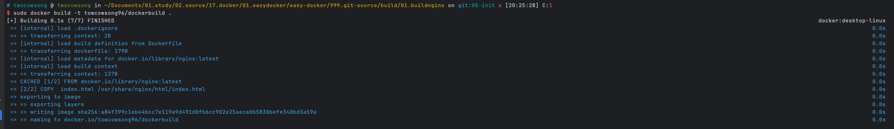

# 이미지 빌드

### 순서


### 1. 명령어
- `docker build -t <이미지명> <DockerFile 경로>`

### 2. 도커파일 명령어
```dockerfile
# 베이스 이지미 지정 - 파일시스템이 있는 이미지로 지정하는것이 좋음
FROM <이미지명> 
# 파일을 레이어로 복사
COPY <파일경로> <복사할경로>
# 컨테이너 실행 시 명령어 지정
CMD <["명령어"]>
```

### 정리
1. `git clone https://github.com/daintree-henry/build.git`
    - 빌드용 코드 다운로드
2. `git switch 00-init`
    - 처음부터 도커파일을 작성할경우
    - 만약, 도커파일 작성을 건너뛰고싶다면 `git switch 01-dockerfile` (브랜치이동)
3. 파일 수정 후 도커파일 생성 (COPY 첫번째 파라미터 경로는 각자에 알맞게 수정필요)
```dockerfile
# nginx 베이스 이미지를 지정
FROM nginx:latest

COPY  index.html /usr/share/nginx/html/index.html

CMD ["nginx", "-g", "daemon off;"]

```
4. `docker build -t <레지스트리계정명> .`
    - 도커파일이 있는경로에서 실행해야함
    - 마지막 `.`은 현재 폴더를 의미 : 현재 폴더에 dockerFile이 있다는걸 의미
5. `docker run -d -p 80:80 --name build-nginx <레지스트리계정명>`
   - 도커빌드는 도커파일을 이용하여 도커가 직접 이미지를 생성하여 더 빠르고 편하게 만들수있음
6. `docker push <레지스트리계정명>`
   - 도커 허브에 이미지 푸쉬

