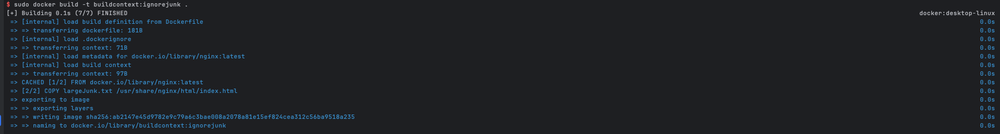

# 빌드 컨텍스트

### 순서
- 이미지 빌드시에 필요없는 파일을 제외하고싶은경우 `.dockerignore` 파일로 관리가 가능

### 명령어
1. docker file 생성
```dockerfile
FROM nginx:latest

COPY largeJunk.txt /usr/share/nginx/html/index.html

CMD ["nginx", "-g", "daemon off;"]
```
2. `largeJunk.txt`파일을생성
```text
It is the large file
```
3. `.dockerignore` 파일을 생성
```text
largeJunk.txt
```
#### 위와같이 `index.html`을 `largeJunk.txt`파일로 덮어씌우려고 하지만 `dockerignore` 파일에 제외조건으로 `largeJunk.txt`이 있어서 빌드 에러가 발생

4. `docker build -t buildcontext:ignorejunk .` 빌드

 -  `"/largeJunk.txt": not found` largeJunk.txt 파일을 찾지 못하여 에러 발생
5. 위 문제를 해결하기 위해 `.dockerignore` 내용을 모두 삭제 후 재 빌드


### 정리
