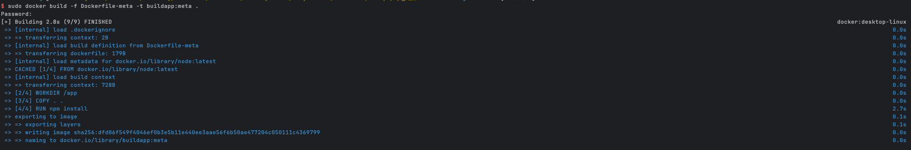

# 도커
## 도커파일 지시어
### 명령어
- docker file 기본적인 명령어 정리
```dockerfile
FROM <이미지명>
COPY <빌드컨텍스트경로> <레이어경로>
RUN <명령어>
CMD <["명령어"]>
```
- docker build -f 명령어 정리
    - `docker build -f <도커파일명> -t <이미지명> <Dockerfile경로>`

### 실습
1. 하위 도커파일 코드로 빌드 진행
```dockerfile
FROM node:latest
COPY ./ /
RUN npm install
CMD ["npm", "start"]

```
2. `docker build -f Dockerfile-basic -t buildapp:dockerbasic .`
    - 도커 파일명 : dockerfile-basic
    - 이미지 명 : buildapp:dockerbasic


## 1. 도커 시스템 지시어 추가
1. 도커 명령어 추가
```dockerfile
# 작업 디렉토리 지정 - cd 명령어와 비슷
WORKDIR <폴더명>
# 명령을 실행할 사용자 변경 
USER <유저명>
# 컨테이너가 사용할 포트를 명시
EXPOSE <포트번호>
```
2. 완성본 도커 파일은 아래와 같음
```dockerfile
FROM node:latest
WORKDIR /app # app 경로로 이동
COPY . . # 현재 경로에서 app 경로로 COPY하기때문에 .으로 입력

RUN npm install

USER node
EXPOSE 3000
CMD ["npm", "start"]
```
3. `docker build -f Dockerfile-meta -t buildapp:meta .`


4. `docker run -d -p 3000:3000 --name builapp-meta buildapp:meta`
    - 빌드 성곤한 이미지를 가지고 도커 실행

## 2. 도커 시스템 지시어 추가
1. 도커 명령어 추가
```dockerfile
# 이미지 빌드 시점의 환경 변수 설정
ARG <변수명> <변수값>
# 이미지 빌드 및 컨테이너 실행 시점의 환경 변수 설정
ENV <변수명> <변수값>
```
2. 도커파일 생성
```dockerfile
FROM node:latest
WORKDIR /app
COPY . .

RUN npm install
ARG COLOR=red

USER node
EXPOSE 3000
CMD ["npm", "start"]
```
3. 2개의 도커파일로 빌드
    - `docker build -f Dockerfile-arg -t buildapp:arg .`
    - `docker build -f Dockerfile-env -t buildapp:env .`
4. 2개의 이미지로 도커 실행
    - `docker run -d -p 3001:3000 --name buildapparg buildapp:arg`
    - `docker run -d -p 3002:3000 --name buildappenv buildapp:env`

## 3. 도커 시스템 지시어 추가
1. 도커 명령어 추가
```dockerfile
# 고정된 명령어를 지정
ENTRYPOINT <["명령어"]>
# 컨테이너 실행 시 명령어 지정
CMD <["명령어">
```
2. 완성된 도커파일 
```dockerfile
FROM node:latest
WORKDIR /app
COPY . .

RUN npm install

USER node
EXPOSE 3000
ENTRYPOINT ["npm"]
CMD ["start"]
```
3. `docker build -f Dockerfile-entrypoint -t buildapp:entry .`
   - 도커 파일 빌드 
4. `docker run -d -p 3003:3000 --name dockerfile-entrypoint buildapp:entry`


