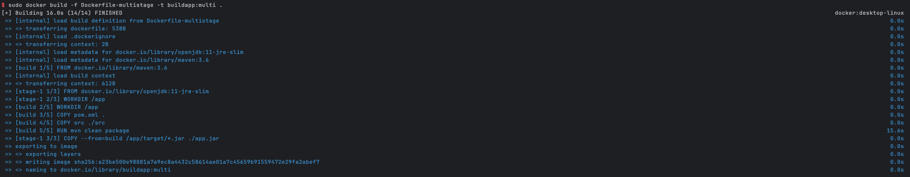

# 멀티 스테이지 빌드

### 설명
- 멀티 스테이지 빌드는 도커파일에서 2개의 베이스 이미지를 활용하여 빌드
- 보통 애플리케이션을 빌드하면서 만들어지는 파일들이 용량을 많음
- 실제 이 파일들은 애플리케이션이 빌드할때 사용되지않음
- 이미지를 빌드 / 실행에 사용되는 용도로 나눔
- 이로인해 실제로 애플리케이션이 실행되는 이미지의 사이즈를 줄일수있음 

### 순서 - Java프로그램 배포 예정(springBoot로 개발)
1. OS위에 Java Runtime과 Maven설치(또는 Gradle설치)
2. 소스코드 다운로드 (git clone)
3. 의존성 라이브러리 설치 및 빌드(mvn clean package)
4. 빌드완료된 *.jar파일로 `java -jar *.jar` 명령어로 실행 가능

### `Dockerfile-singlestage`파일생성 (멀티 스테이지 X)
1. dockerfile 생성
```dockerfile
# 빌드 환경 설정 - 후 app으로 이동
FROM maven:3.6-jdk-11
WORKDIR /app

# app경로에 pom.xml과 src/디렉토리 복사
COPY pom.xml .
COPY src ./src

# 애플리케이션 빌드 - pom.xml과 소스코드릴 이용해 jar파일 생성
RUN mvn clean package

# 빌드된 JAR 파일을 실행 환경으로 복사
RUN cp /app/target/*.jar ./app.jar

# 애플리케이션 실행
EXPOSE 8080
CMD ["java", "-jar", "app.jar"]
```
**위와같이 빌드시에는 애플리케이션 실행에 필요하지않는 파일들이 많이 만들어진다.**
**Maven도구는 애플리케이션을 빌드할때 사용되지, 실행할때는 전혀 사용되지않는다.**
**Maven도구의 사이도 크기에 이미지 사이즈도 커지게된다.**

2. `docker build -f Dockerfile-singlestage -t buildapp:sigle .`

### `Dockerfile-multistage`파일생성 (멀티 스테이지 O)
```dockerfile
# 첫번째 단계 : 빌드 환경 설정
FROM maven:3.6 AS build
WORKDIR /app

# pom.xml과 src/ 디렉토리 복사
COPY pom.xml .
COPY src ./src

# 애플리케이션 빌드
RUN mvn clean package

# 두번째 단계: 실행 환경 설정
FROM openjdk:11-jre-slim
WORKDIR /app

# 빌드 단계에서 생성된 JAR파일을 복사
COPY --from=build /app/target/*.jar ./app.jar

# 애플리케이션 실행
EXPOSE 8080
CMD ["java", "-jar", "app.jar"]
```
2. `docker build -f Dockerfile-multistage -t buildapp:multi .`


### diff
- 하위 생성된 2개의 이미지 비교</br>

- 2개의 사이지가 233MB / 731MB로 확실하게 차이나는걸 볼수있다. 
