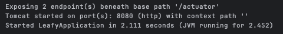

# 클라우드 네이티브(Cloud Native) 애플리케이션

### DB, BACK, FRONT 빌드
1. `docker network create leafy-network`
    - 해당프로젝트에서 사용할 네트워크 생성 
2. `docker run -d --name leafy-postgres --network leafy-network devwikirepo/leafy-postgres:1.0.0`
    - 프로젝트에서 사용할 DB 설치 후 도커 실행
3. `docker logs -f leafy-postgres`
    - DB 컨테이너 로그 조회 후 정상 실행 확인! 
    
4. `docker run -d -p 8080:8080 -e DB_URL=leafy-postgres --network leafy-network --name leafy devwikirepo/leafy-backend:1.0.0`
    - 백엔드 서버 실행 
    - 네트워크, DB설정까지 바로 연동
5. `docker logs -f leafy`
    - 도커 백엔드 로그 확인 
   
    - 백엔드 정상실행.equals(DB 정상 실행)
6. `docker run -d -p 80:80 --network leafy-network --name leafy-front devwikirepo/leafy-frontend:1.0.0`
   - 프론트 엔드 코드 실행

### 명령어

### 정리
