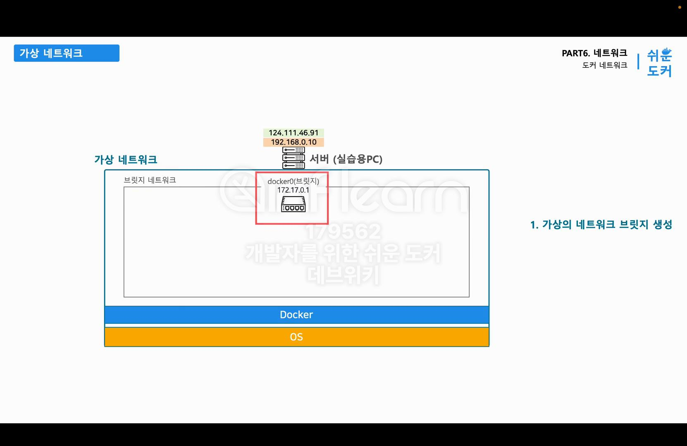
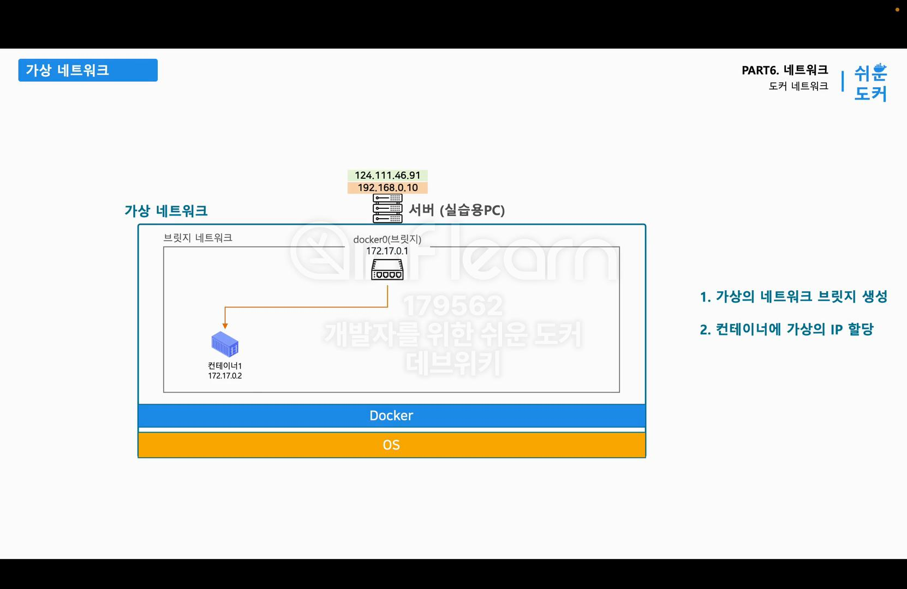
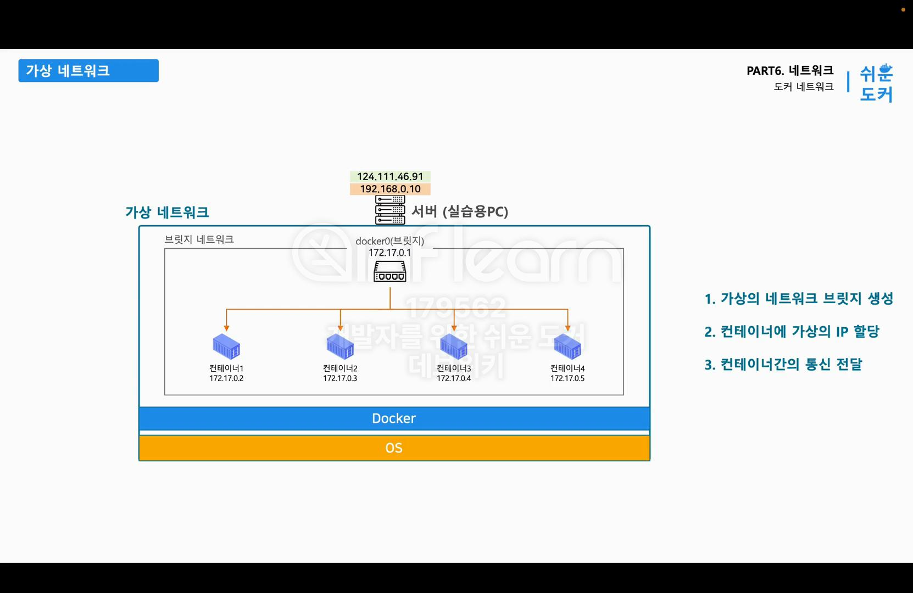
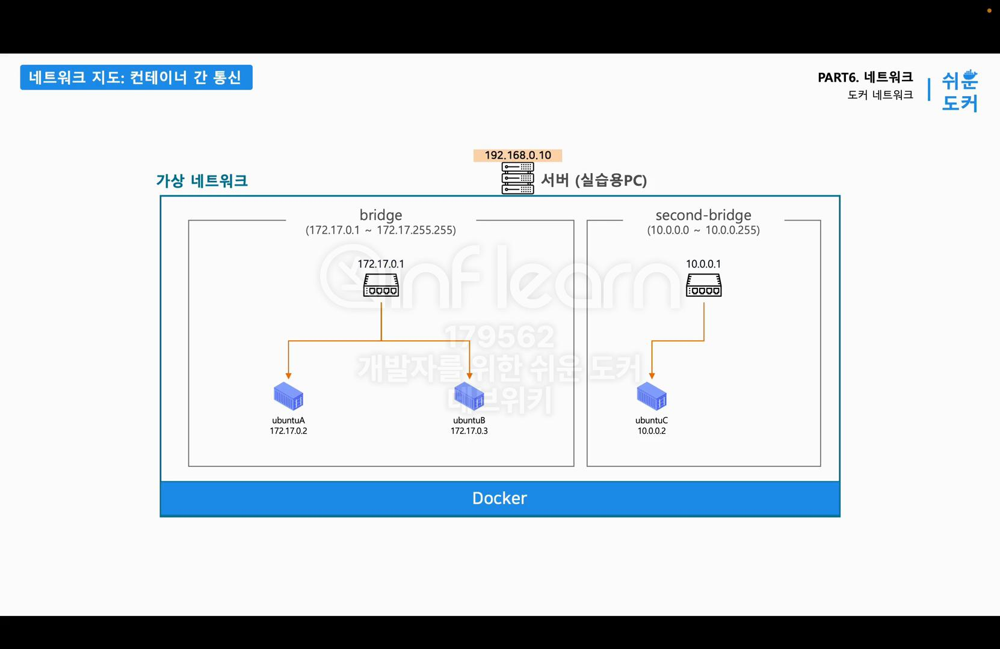

# 도커 가상네트워크

### 설명
가상 네트워크는 실제로 인터넷 선이나 공유기 없이 오로지 한대에 서버내에서 논리적으로 정의 되어있는 네트워크 이기 때문에
가상네트워크라고 부름

### 순서 및 생성
1. 도커를 설치하고 실행시키면 도커는 가상의 네트워크인 브릿지 네트워크와 가상의 공유기인 도커 제로 생성
   - 가상의 공유기 도커 제로를 Docker에서는 브릿지라고 부름 
   - 도커 브릿지 네트워크는 컨테이너들에게 IP를 할당해주고 컨테이너들끼리 통신 할수있게 함

2. 도커에서 컨테이너를 실행하면 도커는 브릿지 네트워크의 IP주소 범위 안에서 IP주소를 할당
   - 공유기에 연결된 기기 한대에 사설 IP가 할당되는것과 동일
   
3. 컨테이너를 3대 추가하면 각각의 컨테이너들은 같은 대역대에서 겹치지 않는 IP를 할당
   - 같은 브릿지에서 생성된 네트워크는 브릿지를 통해서 서로 통신 가능
   - ex) `172.17.0.2`에서 `172.17.0.5` 로 통신하려면, 패킷은 브릿지를 통해서 `172.17.0.5`로 전송되게 됩니다.
   
   
### 목표 
 - 총 2개의 네트워크를 만들고 3개의 컨테이너를 아래와같이 생성하여 컨테이너들간에 통신테스트 진행
      - 도커를 설치하면 기본적인 네트워크(`bridge` 네트워크는 생성됨)
      - 이번 실습에서 `second-bridge`를 생성할 예정
      - IP 범위
         - bridge : `172.17.0.1 ~ 172.17.255.255`
         - secode-bridge : `10.0.0.0 ~ 10.0.0.255`

- `ubuntuA` 와 `ubuntuB`의 통신 여부 체크
- `ubuntuC` 컨테이너는 `ubuntuA`와 `ubuntuB` 컨테이너의 통신이 되는지 체크

### 코드 사용
1. `docker network ls`
   - 도커 네티워크 리스트 조회
2. `docker network inspect bridge`
   - 네트워크 상세 정보 조회
```json
   ...   
   "Config": [
       {
            // Subnet : 네트워크 안에서 생성되는 컨테이너들이 할당받는 IP의 범위
            // 172.17.0.0 ~ 172.17.255.255
            "Subnet": "172.17.0.0/16",
            // Gateway는 실제 해당 네트워크에서 브릿지의 IP주소
            "Gateway": "172.17.0.1"
       }
   ]
   ...
```
3. `docker network create --driver bridge --subnet 10.0.0.0/24 --gateway 10.0.0.1 secode-bridge`
   - secode-bridge 네트워크 생성
   - ```json
        "Config": [
            {
                "Subnet": "10.0.0.0/24",
                "Gateway": "10.0.0.1"
            }
         ]
      ```
4. `docker run -d --name ubuntuA devwikirepo/pingbuntu `
5. `docker run -d --name ubuntuB devwikirepo/pingbuntu `
6. `docker run -d --name ubuntuC --network secode-bridge devwikirepo/pingbuntu`
7. `docker container inspect ubuntuA`
   ```json
      ...
       "Networks": {
                "bridge": {
                    ...
                    "Gateway": "172.17.0.1",
                    "IPAddress": "172.17.0.2",
                    ...
                }
            }
      ...
   ```
7. `docker container inspect ubuntuB`
   ```json
      "Networks" : {
          "bridge": {
             ...
             "Gateway": "172.17.0.1",
             "IPAddress": "172.17.0.3",
             ...
        }
   ```
8. `docker container inspect ubuntuC`
   ```json
      "Networks": {
         "secode-bridge": {
            ...
            "Gateway": "10.0.0.1",
            "IPAddress": "10.0.0.2"
            ...
         }
      }
   ```
9. `ping 172.17.0.2`
   - ubuntuB 컨테이너에서 ubuntuA(172.17.0.2) 컨테이너의 ping 테스트시 정상적으로 전달되는걸 확인 가능
   - ubuntuB(172.17.0.3) -> ubuntuC(10.0.0.2)의 컨테이너로 ping 테스트시 정상적으로 전달되지 않는걸 확인 할 수 있음
   - ubuntuC(10.0.0.2) -> ubuntuB(172.17.0.3)의 컨테이너로 ping 테스트시 정상적으로 전달되지 않는걸 확인 할 수 있음
   - 이렇게 같은 네트워크 안에서는 연결되어있지만, 다른네트워크에서 전달을 받지못함

10. `docker network rm <네트워키 이름>`


### 스터디 중 기록

- Bridge 네트워크 (기본)
-  Host 네트워크
      - 컨테이너가 호스트의 네트워크 스택을 직접 사용합니다.
      - 별도의 네트워크 격리가 없어 성능이 좋지만, 보안상 주의가 필요합니다.
- None 네트워크
  - 컨테이너에 네트워크 인터페이스를 제공하지 않습니다.
  - 완전히 격리된 상태로 컨테이너를 실행할 때 사용합니다.
- Overlay 네트워크
  - 여러 Docker 데몬 호스트 간에 분산된 네트워크를 생성합니다.
  - Swarm 모드에서 서비스 간 통신에 주로 사용됩니다.
